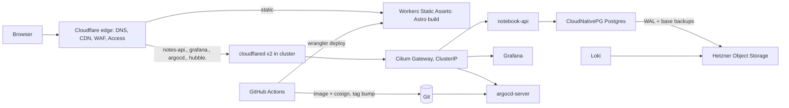

# Architecture

Living document. Decisions are recorded in [ADRs](adr/README.md); this page
is the map. Updated at the end of every milestone.

## System shape

## Layers and who owns what

| Layer | Technology | Lives in | Portable? |
| --- | --- | --- | --- |
| Public site | Astro 6 static build | Cloudflare Workers Static Assets | Yes: a directory of files |
| Edge | Cloudflare DNS, CDN, WAF, Tunnel, Access, rate limiting | `infra/terraform/cloudflare` | Provider-specific by design; the only Cloudflare-bound layer |
| Cluster | Talos Linux, Cilium, Gateway API, hcloud CCM/CSI | `infra/terraform/hetzner` | Talos and Cilium yes; CCM/CSI swapped per provider |
| GitOps | Argo CD, KSOPS | `k8s/bootstrap`, `k8s/clusters` | Yes |
| Platform | cloudflared, cert-manager, CNPG operator, kube-prometheus-stack, Loki, Alloy | `k8s/infrastructure` | Yes; S3 endpoint is configuration |
| Workloads | notebook-api (Go) and later services | `k8s/apps`, `apps/*` | Yes |
| State | PostgreSQL via CNPG; S3-compatible object storage | CNPG clusters; Hetzner Object Storage now | Yes, by ADR-0010 |

## Environments

| Name | Purpose | Status |
| --- | --- | --- |
| `hetzner` | First production cluster, Falkenstein | Milestone 2 |
| `home` | Future primary cluster on homelab hardware | Phase 2 |
| local | `astro dev`, `go run`, Docker Compose Postgres for tests | Milestone 1/4 |

## Hostnames

| Host | Serves | Protection |
| --- | --- | --- |
| `ivanpanev.net`, `www` | static site | public |
| `notes-api.ivanpanev.net` | notebook API | Cloudflare rate limit; application limits |
| `grafana.ivanpanev.net` | Grafana | Cloudflare Access |
| `argocd.ivanpanev.net` | Argo CD UI | Cloudflare Access |
| `hubble.ivanpanev.net` | Hubble UI | Cloudflare Access |

Flat subdomains only: Cloudflare Universal SSL covers `*.ivanpanev.net` but
not deeper wildcards.

## Constraints to remember

- Cloudflare proxy: 100 MB request body (Free/Pro), 100 s origin timeout, no
  UDP through Tunnel.
- Hetzner block volumes are ReadWriteOnce and do not leave Hetzner.
- Kubernetes and Talos APIs are reachable only from the operator's address.
- One control-plane node in Phase 1 means one etcd copy. Reboot: API
  unavailable, workloads keep running. Disk loss: cluster rebuild from Git +
  Terraform, data restored from object storage (CNPG) or etcd snapshot.
  Accepted RTO four hours (ADR-0004).

## Milestone log

| Milestone | Delivered | Review |
| --- | --- | --- |
| M0 | Repository, ADR set, critic process, toolchain scripts | pending |
